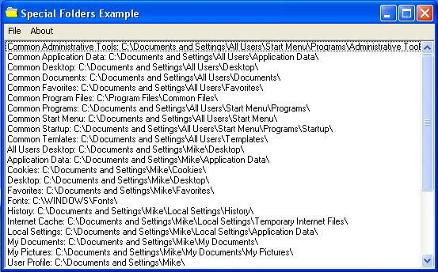



## Windows Special Folders

### Description

With this module you will be able to get the directory of 43 different Windows Special Folders ex. Windows, System, Program Files. sorry for not commenting and i hope you find this useful example included.
 
### More Info
 

             |
---                |---
**Submitted On**   |2004-10-07 03:29:36
**By**             |[Mike Bruer](https://github.com/Planet-Source-Code/PSCIndex/blob/master/ByAuthor/mike-bruer.md)
**Level**          |Beginner
**User Rating**    |5.0 (40 globes from 8 users)
**Compatibility**  |VB 5\.0, VB 6\.0
**Category**       |[Miscellaneous](https://github.com/Planet-Source-Code/PSCIndex/blob/master/ByCategory/miscellaneous__1-1.md)
**World**          |[Visual Basic](https://github.com/Planet-Source-Code/PSCIndex/blob/master/ByWorld/visual-basic.md)
**Archive File**   |[Windows\_Sp1802031072004\.zip](https://github.com/Planet-Source-Code/mike-bruer-windows-special-folders__1-56570/archive/master.zip)

